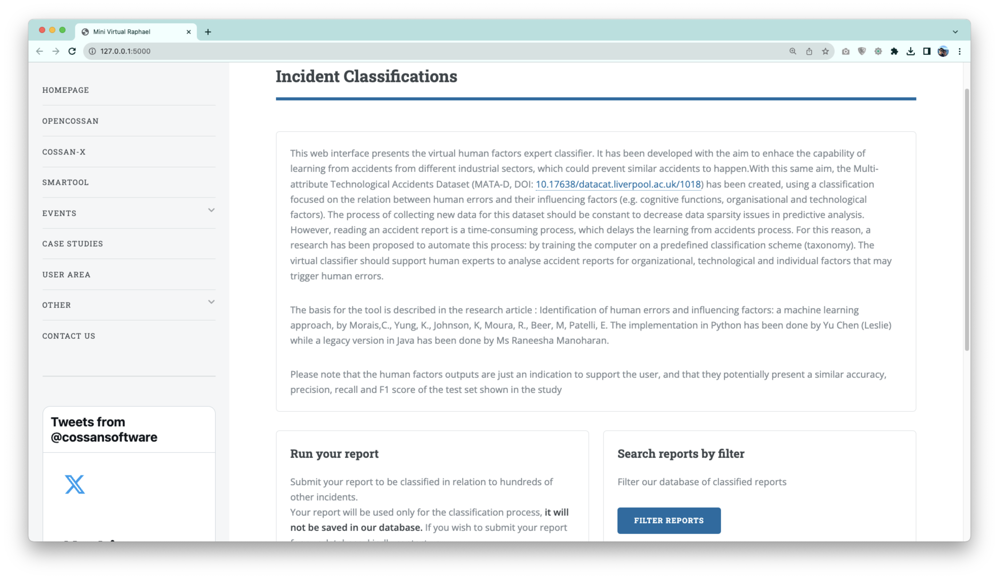
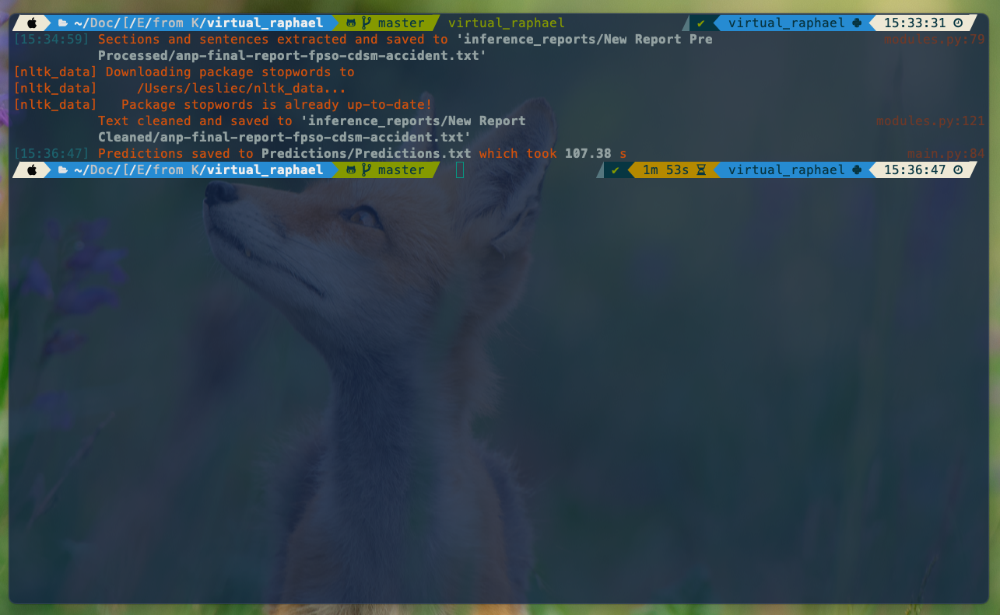

Virtual Raphael
==============================

Human error classifier based on MATA-D and Machine Learning algorithm. `Virtual Raphael` is a web interface that presents the virtual human factor expert classifier. It has been developed with the aim to enhance the capability of learning from accidents from different industrial sectors, which could prevent similar accidents to happen.

Reading an accident report is a time-consuming process, which delays the learning from accidents. For this reason, a study has been conducted to automate this process by training the computer on a predefined classification scheme. The virtual classifier should support human experts to analyse accidents reports for organizational, technological and individual facters that may trigger human errors.

## *highlights*

- [x] Based on the Google BERT model;
- [x] Multi-language support for reading reports.


## web application

An intuitive web application[^1] is created for facilitating the use of `Virtual Raphael`. 

[](visualisations/UI.png)

## command line interface

The application can be easily run from terminal, after [installing the package locally](#installation). Put your PDF file into the directory `inference_reports/New Report` and call the CLI command as below. Currently, running a cycle of all the models takes about 110s. The results and visualisations will be saved into the `Predictions` directory. 

```shell
$ virtual_raphael
```




## installation

Pre-traioned models should be downloaded separately and then put into a directory named `models`. Refer to [caveats](#caveats). For installing[^2]

```shell
pip install .
```

### caveats

Pre-trained models are of size **23.21GB**, which can be downloaded [here](https://strath-my.sharepoint.com/personal/karl_johnson_strath_ac_uk/_layouts/15/onedrive.aspx?ga=1&id=%2Fpersonal%2Fkarl%5Fjohnson%5Fstrath%5Fac%5Fuk%2FDocuments%2FDocuments%2FVirtual%20Raphael%2FVirtual%20Raphael%20Package%2FModels).

### reference
```markdown
@article{morais2022identification,
  title={Identification of human errors and influencing factors: A machine learning approach},
  author={Morais, Caroline and Yung, Ka Lai and Johnson, Karl and Moura, Raphael and Beer, Michael and Patelli, Edoardo},
  journal={Safety science},
  volume={146},
  pages={105528},
  year={2022},
  publisher={Elsevier}
}
```

--------
[^1]: Created by [Yu Chen](https://yuchenakaleslie.github.io/) with Flask;
[^2]: Project based on the <a target="_blank" href="https://drivendata.github.io/cookiecutter-data-science/">cookiecutter data science project template</a>. 